# GRAF - DRZEWO BINARNE

Drzewo binarne oznaczone etykietami o rozmiarze $\text{» } {\color{limegreen}max} = 7\text{ «}$ (liczba węzłów w drzewie) i wysokości $\text{» } {\color{yellow}ih} = 2\text{ «}$ (wysokość $\text{» } {\color{yellow}h} \text{ «}$ drzewa zdefiniowana jako liczba krawędzi lub połączeń od najwyższego węzła lub węzła głównego (ROOT) do najdalszego węzła liścia) z węzłem głównym, którego wartość wynosi 1. Poniższe drzewo jest zrównoważone, ale nie jest (może nie być) posortowane. Standardowo węzły w drzewie indeksuje się kolejnymi liczbami naturalnymi, rozpoczynając w korzeniu od $1$, nadając indeksy na kolejnych poziomach wysokości **od lewej do prawej**, w dalszym toku oznaczone jako $\text{» } {\color{violet}iLR}\text{ «}$ (lub też jako liczba poprzedzająca ${\color{violet} i →│}$ symbol). Dodatkowo w tym przypadku, wprowadzono drugi lustrzany indeks **od prawej do lewej**  $\text{» } {\color{violet}iRL}\text{ «}$ (lub też jako liczba występująca po ${\color{violet} │← i}$ symbolu). 

```mermaid
---
config:
  layout: elk
  look: handDrawn
  theme: dark
---
graph TD
  1["ROOT <br> 1 →│← 1"]
  1 <--> 2["NODE-L <br> 2 →│← 3"]
  1 <--> 3["NODE-R <br> 3 →│← 2"]
  2 <--> 4["NODE-L <br> 4 →│← 7"]
  2 <--> 5["NODE-R <br> 5 →│← 6"]
  3 <--> 6["NODE-L <br> 6 →│← 5"]
  3 <--> 7["NODE-R <br> 7 →│← 4"]

   style 1 fill:#602c3e,stroke:#AAA,stroke-width:1px
   style 2 fill:#593704,stroke:#AAA,stroke-width:1px
   style 3 fill:#593704,stroke:#AAA,stroke-width:1px
   style 4 fill:#364613,stroke:#AAA,stroke-width:1px
   style 5 fill:#364613,stroke:#AAA,stroke-width:1px
   style 6 fill:#364613,stroke:#AAA,stroke-width:1px
   style 7 fill:#364613,stroke:#AAA,stroke-width:1px

```



Powyższe jak i każde drzewo binarne jest taką strukturą, w której wyróżniamy:

- **ROOT/KORZEŃ/WĘZEŁ-GŁÓWNY** — _wierzchołek będący na samej górze_ 
  >  (w powyższym przypadku <span style="background:#602c3e;">[ `1` →│← `1` ]</span> )
- **NODE/WĘZEŁ** — _wierzchołek poniżej korzenia (rozróżniamy tu **NODE-L/WĘZEŁ-LEWY** oraz **NODE-R/WĘZEŁ-PRAWY**)_
  > (w powyższym przypadku <span style="background:#593704;">[ `2..3` →│← `3..2` ]</span> oraz  <span style="background:#364613;">[ `4..7` →│← `7..4` ]</span> )
- **NODE/WĘZEŁ/LIŚĆ** — _wierzchołek poniżej korzenia najniżej, to liść_
  > (w powyższym przypadku   <span style="background:#364613;">[ `4..7` →│← `7..4` ]</span> )

---
  
## 1. Obliczanie ${\color{yellow}ih({\color{violet}i})}$ **wysokości/poziomu** na podstawie indeksu ${\color{violet}i}$.

$$
  \begin{aligned}
   {\color{yellow}h({\color{violet}i})} = \lfloor \log_2({\color{violet}i}) \rfloor 
     \quad  \forall\, {\color{violet}i} \in \{ {\color{violet}iLR}, {\color{violet}iRL} \} \subset \mathbb{N}_{+}
  \end{aligned}
$$

## 2. Różne obliczenia tylko i wyłącznie na podstawie ${\color{yellow}h({\color{violet}i})}$  **wysokości/poziomu**.

$$
  \begin{aligned}
    {\color{limegreen}max({\color{yellow}ih({\color{violet}i})})} = &
    {\color{limegreen}total({\color{yellow}ih({\color{violet}i})})} = \\ 
    & \quad = 2^{({\color{yellow}ih}+1)}-1  & \forall \, {\color{yellow}ih} \in \mathbb{N}_{0} \\
    \\
    {\color{limegreen}min({\color{yellow}ih({\color{violet}i})})} = &
    {\color{limegreen}count({\color{yellow}ih({\color{violet}i})})} = \\ 
    & \quad = 2^{{\color{yellow}ih}}  & \forall \, {\color{yellow}ih} \in \mathbb{N}_{0} \\
    \\
    {\color{limegreen}mix({\color{yellow}ih({\color{violet}i})})} = &
    {\color{limegreen}min({\color{yellow}ih({\color{violet}i})})} + {\color{limegreen}max({\color{yellow}ih({\color{violet}i})})} = \\
    = & ( {\color{violet}iLR} + {\color{violet}iRL}) = \\ 
    & \quad = 3 \cdot 2^{{\color{yellow}ih}}-1  & \forall \, {\color{yellow}ih} \in \mathbb{N}_{0}
  \end{aligned}
$$

- ${\color{limegreen}max({\color{yellow}ih({\color{violet}i})})} = {\color{limegreen}total({\color{yellow}ih({\color{violet}i})})}$ - określa ilość wszystkich węzłów, oraz wartość najwyższego indeksu węzła na poziomie danej wysokosci.
- ${\color{limegreen}min({\color{yellow}ih({\color{violet}i})})} = {\color{limegreen}count({\color{yellow}ih({\color{violet}i})})}$ - określa ilość węzłów na danym poziomie wysokości, oraz wartość najniższego indeksu węzła na poziomie danej wysokosci.
- ${\color{limegreen}mix({\color{yellow}ih({\color{violet}i})})} = {\color{limegreen}min({\color{yellow}ih({\color{violet}i})})} + {\color{limegreen}max({\color{yellow}ih({\color{violet}i})})} = ( {\color{violet}iLR} + {\color{violet}iRL})$ - jest to złożona wartość,również stała dla danego poziomu wysokości. Jest zarówno sumą z $({\color{limegreen}min}+{\color{limegreen}max})$, jak i sumą naprzemiennych ${\color{violet}i}$ indeksów w danej pozycji **NODE** $( {\color{violet}iLR} + {\color{violet}iRL})$.

## 3. Wędrowanie po drzewie. 

$$
\begin{aligned}
{\color{skyblue}child_{LEFT}({\color{violet}i})}   &= 
  \begin{cases}
    2 \cdot {\color{violet}i}     & \quad \text{dla } {\color{violet}i} = {\color{violet}iLR} \\
    2 \cdot {\color{violet}i} + 1 & \quad \text{dla } {\color{violet}i} = {\color{violet}iRL}
  \end{cases}
\\[1.2em]
{\color{skyblue}child_{RIGHT}({\color{violet}i})}  &= 
  \begin{cases}
    2 \cdot {\color{violet}i} + 1 & \quad \text{dla } {\color{violet}i} = {\color{violet}iLR} \\
    2 \cdot {\color{violet}i}     & \quad \text{dla } {\color{violet}i} = {\color{violet}iRL}
  \end{cases}
\\[1.2em]
{\color{skyblue}parent({\color{violet}i})}         &= 
  \begin{cases}
    \varnothing                            & \quad \text{dla } {\color{violet}i} < 2 \\
    \lfloor \dfrac{{\color{violet}i}}{2} \rfloor & \quad \text{dla } {\color{violet}i} \geq 2
  \end{cases}
  \quad \text{gdzie } {\color{violet}i} \in \{ {\color{violet}iLR}, {\color{violet}iRL} \}
\\[1.2em]
{\color{skyblue}sibling({\color{violet}i})}        &=
  \begin{cases}
    \varnothing                         & \quad \text{dla } {\color{violet}i} < 2 \\
    {\color{violet}i} + 1                      & \quad \text{dla } {\color{violet}i} = {\color{violet}iLR} \land {\color{violet}i} \bmod 2 = 0 \\
    {\color{violet}i} - 1                      & \quad \text{dla } {\color{violet}i} = {\color{violet}iLR} \land {\color{violet}i} \bmod 2 = 1 \\
    {\color{violet}i} - 1                      & \quad \text{dla } {\color{violet}i} = {\color{violet}iRL} \land {\color{violet}i} \bmod 2 = 0 \\
    {\color{violet}i} + 1                      & \quad \text{dla } {\color{violet}i} = {\color{violet}iRL} \land {\color{violet}i} \bmod 2 = 1
  \end{cases}
\end{aligned}
$$
## 4. Obliczanie indeksu odwrotnego.

$$
\begin{aligned}
{\color{violet}iRL({\color{violet}iLR})}   &= {\color{limegreen}mix({\color{yellow}ih({\color{violet}i})})}  - {\color{violet}iLR}
\\[1.2em]
{\color{violet}iLR({\color{violet}iRL})}   &= {\color{limegreen}mix({\color{yellow}ih({\color{violet}i})})}  - {\color{violet}iRL}
\end{aligned}
$$

## 5. Dodatkowy indeks w obrębie poziomu danej wysokości.
Uniwersalnym indeksem dokładnie wskazującym na miejsce,po odpowiednim przeliczeniu jest ${\color{violet}iLR}$ oraz ${\color{violet}iRL}$, jednakowoż dla wygody, co w pełni z niego już wynika wprowadzamy ${{\color{violet}i}{\color{yellow}ih}{\color{violet}INC}}$ oraz ${{\color{violet}i}{\color{yellow}ih}{\color{violet}DEC}}$, które w obrębie konkretnego poziomu wysokości ${\color{yellow}ih}$, wprowadzają indeks lokalny w jegoż obrębie.

$$
\begin{aligned}
{{\color{violet}i}{\color{yellow}ih}{\color{violet}INC}}   &= {\color{violet}iLR} - {\color{limegreen}min({\color{yellow}h({\color{violet}i})})}
\\[1.2em]
{{\color{violet}i}{\color{yellow}ih}{\color{violet}DEC}}   &={\color{violet}iRL} - {\color{limegreen}min({\color{yellow}h({\color{violet}i})})}
\end{aligned}
$$

## 6. ODZWIERCIEDLENIE W KODZIE TYPESCRIPT

```typescript
type NodeConstructor<T> = new (node: number, X?: "XM" | "XW") => T;

class Node {
  ihINC: number; // iLR: number;
  ihDEC: number; // iRL: number;
  ih: number; // lvX: number;
  MAX: number; // MAX: number;
  MIN: number; // MIN: number;
  MIX: number; // MIX: number;
  iRL: number; // XM: number;
  iLR: number; // XW: number;

  constructor(node: number, X: "XM" | "XW" = "XM") {
    if (typeof node !== "number" || !Number.isInteger(node) || node <= 0) {
      throw new Error("Parametr node musi być dodatnią liczbą całkowitą.");
    }
    const height = Math.floor(Math.log2(node));
    const nodeMAX = 1 * Math.pow(2, height + 1) - 1;
    const nodeMIN = 1 * Math.pow(2, height + 0) - 0;
    const nodeMIX = 3 * Math.pow(2, height + 0) - 1;

    const nodeXM = X == "XM" ? node : /* X=="XW" */ nodeMIX - node;
    const nodeXW = X == "XM" ? nodeMIX - node : /* X=="XW" */ node;
    const sortXM_LR = nodeXM - nodeMIN;
    const sortXW_RL = nodeXW - nodeMIN;

    this.ihINC = sortXM_LR;
    this.ihDEC = sortXW_RL;
    this.ih = height;
    this.MAX = nodeMAX;
    this.MIN = nodeMIN;
    this.MIX = nodeMIX;
    this.iLR = nodeXM;
    this.iRL = nodeXW;
  }

  static ofRange<T extends Node>(
    this: NodeConstructor<T>,
    A: number,
    Z: number,
    X: "XM" | "XW" = "XM",
  ): T[] {
    const OUT: T[] = [];
    for (let i = A; i <= Z; i++) {
      OUT.push(new this(i, X));
    }
    return OUT;
  }

  static ofMulti<T extends Node>(
    this: NodeConstructor<T>,
    R: string,
    X: "XM" | "XW" = "XM",
  ): T[] {
    const RANGE = ((input: string): number[] => {
      const result = new Set<number>();

      for (const token of input.trim().split(" ")) {
        if (!token) continue;

        if (token.includes("..")) {
          const [start, end] = token.split("..").map(Number);
          if (Number.isInteger(start) && Number.isInteger(end)) {
            const step = start <= end ? 1 : -1;
            for (let i = start; step > 0 ? i <= end : i >= end; i += step) {
              result.add(i);
            }
          }
        } else {
          const num = Number(token);
          if (Number.isInteger(num)) {
            result.add(num);
          }
        }
      }

      return [...result].sort((a, b) => a - b);
    })(R);

    const OUT: T[] = [];
    for (const i of RANGE) {
      OUT.push(new this(i, X));
    }
    return OUT;
  }
}
```


## 7 PODSUMOWANIE NA GRAFIE.

```mermaid
---
config:
  layout: elk
  look: handDrawn
  theme: dark
---
graph TD
  01["iLR = 1 <br /> iRL = 1  <br /> ih = 0 <br /> ihINC = 0 <br /> ihDEC = 0 <br /> MAX = 1 <br /> MIN = 1 <br /> MIX = 2"]
  01 <--> 02["iLR = 2 <br /> iRL = 3 <br /> ih = 1 <br /> ihINC = 0 <br /> ihDEC = 1 <br /> MAX = 3 <br /> MIN = 2 <br /> MIX = 5"]
  01 <--> 03["iLR = 3 <br /> iRL = 2 <br /> ih = 1 <br /> ihINC = 1 <br /> ihDEC = 0 <br /> MAX = 3 <br /> MIN = 2 <br /> MIX = 5"]
  02 <--> 04["iLR = 4 <br /> iRL = 7 <br /> ih = 2 <br /> ihINC = 0 <br /> ihDEC = 3 <br /> MAX = 7 <br /> MIN = 4 <br /> MIX = 11"]
  02 <--> 05["iLR = 5 <br /> iRL = 6 <br /> ih = 2 <br /> ihINC = 1 <br /> ihDEC = 2 <br /> MAX = 7 <br /> MIN = 4 <br /> MIX = 11"]
  03 <--> 06["iLR = 6 <br /> iRL = 5 <br /> ih = 2 <br /> ihINC = 2 <br /> ihDEC = 1 <br /> MAX = 7 <br /> MIN = 4 <br /> MIX = 11"]
  03 <--> 07["iLR = 7 <br /> iRL = 4 <br /> ih = 2 <br /> ihINC = 3 <br /> ihDEC = 0 <br /> MAX = 7 <br /> MIN = 4 <br /> MIX = 11"]
  04 <--> 08["iLR = 8 <br /> iRL = 15 <br /> ih = 3 <br /> ihINC = 0 <br /> ihDEC = 7 <br /> MAX = 15 <br /> MIN = 8 <br /> MIX = 23"]
  04 <--> 09["iLR = 9 <br /> iRL = 14 <br /> ih = 3 <br /> ihINC = 1 <br /> ihDEC = 6 <br /> MAX = 15 <br /> MIN = 8 <br /> MIX = 23"] 
  05 <--> 10["iLR = 10 <br /> iRL = 13 <br /> ih = 3 <br /> ihINC = 2 <br /> ihDEC = 5 <br /> MAX = 15 <br /> MIN = 8 <br /> MIX = 23"]
  05 <--> 11["iLR = 11 <br /> iRL = 12 <br /> ih = 3 <br /> ihINC = 3 <br /> ihDEC = 4 <br /> MAX = 15 <br /> MIN = 8 <br /> MIX = 23"]
  06 <--> 12["iLR = 12 <br /> iRL = 11 <br /> ih = 3 <br /> ihINC = 4 <br /> ihDEC = 3 <br /> MAX = 15 <br /> MIN = 8 <br /> MIX = 23"]
  06 <--> 13["iLR = 13 <br /> iRL = 10 <br /> ih = 3 <br /> ihINC = 5 <br /> ihDEC = 2 <br /> MAX = 15 <br /> MIN = 8 <br /> MIX = 23"]
  07 <--> 14["iLR = 14 <br /> iRL = 9 <br /> ih = 3 <br /> ihINC = 6 <br /> ihDEC = 1 <br /> MAX = 15 <br /> MIN = 8 <br /> MIX = 23"]
  07 <--> 15["iLR = 15 <br /> iRL = 8 <br /> ih = 3 <br /> ihINC = 7 <br /> ihDEC = 0 <br /> MAX = 15 <br /> MIN = 8 <br /> MIX = 23"]
 

   style 01 fill:#602c3e,stroke:#AAA,stroke-width:1px
   style 02 fill:#593704,stroke:#AAA,stroke-width:1px
   style 03 fill:#593704,stroke:#AAA,stroke-width:1px
   style 04 fill:#364613,stroke:#AAA,stroke-width:1px
   style 05 fill:#364613,stroke:#AAA,stroke-width:1px
   style 06 fill:#364613,stroke:#AAA,stroke-width:1px
   style 07 fill:#364613,stroke:#AAA,stroke-width:1px
   style 08 fill:#004a51,stroke:#AAA,stroke-width:1px
   style 09 fill:#004a51,stroke:#AAA,stroke-width:1px
   style 10 fill:#004a51,stroke:#AAA,stroke-width:1px
   style 11 fill:#004a51,stroke:#AAA,stroke-width:1px
   style 12 fill:#004a51,stroke:#AAA,stroke-width:1px
   style 13 fill:#004a51,stroke:#AAA,stroke-width:1px
   style 14 fill:#004a51,stroke:#AAA,stroke-width:1px
   style 15 fill:#004a51,stroke:#AAA,stroke-width:1px

```


---
